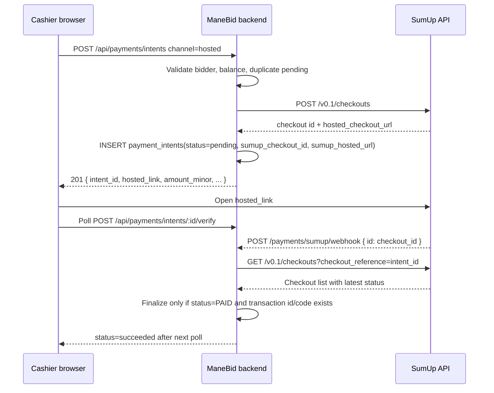
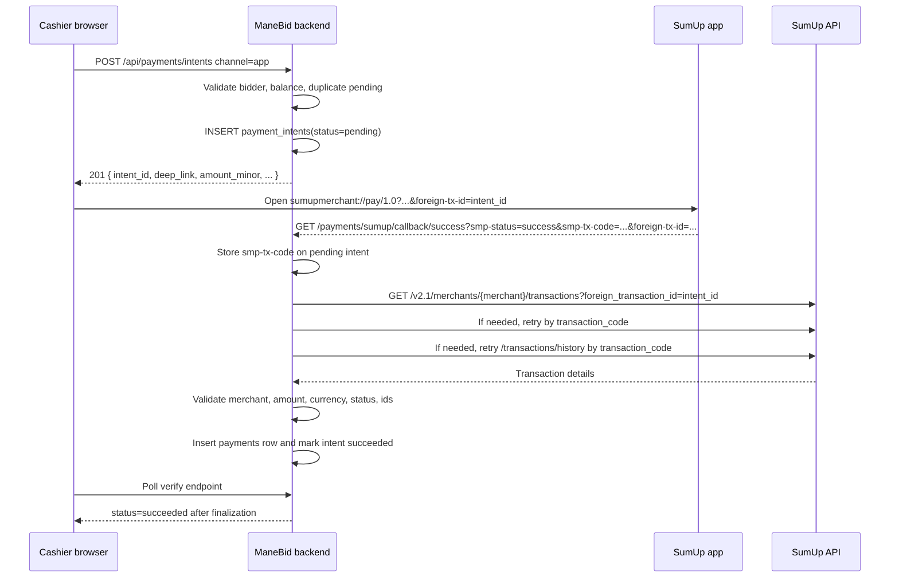
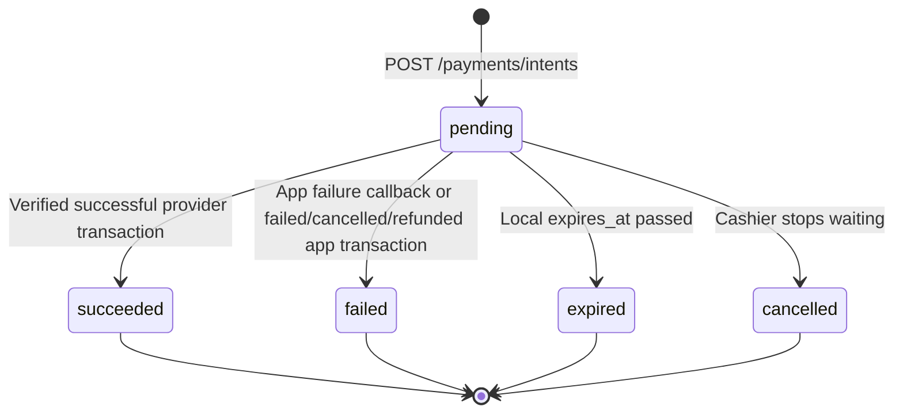

# ManeBid Payment Processor Design

Developer-focused design notes for the SumUp payment processor implemented in
`backend/payments.js`.

Current implementation snapshot:

- Main backend module: `backend/payments.js`
- SumUp API helper: `backend/sumup-client.js`
- App transaction verifier: `backend/sumup-verification.js`
- Payment intent schema: `backend/db.js`
- Cashier frontend: `public/scripts/settlement.js`
- Cashier markup: `public/cashier/index.html`

This document describes the code as implemented in the current working tree,
including persistent pending SumUp payments, manual cancellation, hosted
checkout retry handling, app callback transaction-code storage, and transaction
history fallback.

## Goals

The payment processor exists to let a cashier collect settlement payments and
optional donations using SumUp without ever treating browser redirects or app
callbacks as authoritative proof of payment.

The design goals are:

- Create a local payment intent before sending the cashier/customer to SumUp.
- Keep all SumUp payments pending until verified server-to-server.
- Record each successful provider transaction exactly once.
- Keep failed hosted checkout attempts retryable until success, manual cancel,
  or local expiry.
- Let the cashier see and manage pending payments after switching bidder or
  refreshing the cashier screen.
- Avoid storing card data. Store only local intent data and a minimal provider
  verification snapshot.

## External SumUp Concepts

The implementation uses two SumUp payment channels.

| ManeBid channel | Cashier label | SumUp mechanism | Local `payment_intents.channel` |
| --- | --- | --- | --- |
| Card reader | SumUp card reader | SumUp app deep link | `app` |
| Web checkout | SumUp web | SumUp hosted checkout | `hosted` |

Relevant SumUp API details:

- Hosted checkouts are created with `POST /v0.1/checkouts`.
- SumUp returns a `hosted_checkout_url` when hosted checkout is enabled.
- Hosted checkout objects have statuses including `PENDING`, `FAILED`, `PAID`,
  and `EXPIRED`.
- The hosted checkout `checkout_reference` is merchant-defined and is used by
  ManeBid to correlate SumUp records with a local payment intent.
- Transactions are the authoritative payment result. SumUp supports retrieving
  a transaction by query parameters including `transaction_code` and
  `foreign_transaction_id` on
  `GET /v2.1/merchants/{merchant_code}/transactions`.
- The implementation also tries
  `GET /v2.1/merchants/{merchant_code}/transactions/history` by
  `transaction_code` as a fallback.

References:

- SumUp Checkouts API: `https://developer.sumup.com/api/checkouts`
- SumUp Transactions API: `https://developer.sumup.com/api/transactions`

Operational note from real testing: card-present transactions may be recorded
under the root real merchant account even when testing through a sandbox-like
setup. The callback URL can still be reached, but server-side transaction
lookup only succeeds when `SUMUP_API_KEY` and `SUMUP_MERCHANT_CODE` belong to
the merchant account that owns the terminal transaction.

## Configuration

`backend/payments.js` reads payment configuration from `backend/config.js`.

| Variable | Used by | Purpose |
| --- | --- | --- |
| `SUMUP_WEB_ENABLED` | intent creation | Enables hosted checkout creation. |
| `SUMUP_CARD_PRESENT_ENABLED` | intent creation | Enables SumUp app deep-link payments. |
| `SUMUP_API_KEY` | hosted checkout, verification | Bearer token for SumUp API calls. Required when either SumUp channel is enabled. |
| `SUMUP_MERCHANT_CODE` | hosted checkout, verification | Merchant account that receives or owns payments. Required when either SumUp channel is enabled. |
| `SUMUP_RETURN_URL` | hosted checkout | URL supplied to SumUp when creating hosted checkouts. |
| `SUMUP_AFFILIATE_KEY` | app deep link | SumUp app affiliate key. |
| `SUMUP_APP_ID` | app deep link | SumUp app identifier. |
| `SUMUP_CALLBACK_SUCCESS` | app deep link | Return URL for app success callback. |
| `SUMUP_CALLBACK_FAIL` | app deep link | Return URL for app failure callback. |
| `PAYMENT_TTL_MIN` | local intents | Local pending intent expiry window. |
| `CURRENCY` | all payment flows | Currency used in SumUp and local records. |

`backend/config.js` validates the SumUp environment in layers:

- if either `SUMUP_WEB_ENABLED` or `SUMUP_CARD_PRESENT_ENABLED` is true,
  `SUMUP_API_KEY` and `SUMUP_MERCHANT_CODE` must be present;
- if `SUMUP_WEB_ENABLED` is true, `SUMUP_RETURN_URL` must also be present;
- if `SUMUP_CARD_PRESENT_ENABLED` is true, `SUMUP_AFFILIATE_KEY`,
  `SUMUP_APP_ID`, `SUMUP_CALLBACK_SUCCESS`, and `SUMUP_CALLBACK_FAIL` must
  also be present.

If a channel is enabled but the related SumUp values are wrong, payment launch
may still partially work, but finalization will not. Card-present app payments
need a `SUMUP_API_KEY` and `SUMUP_MERCHANT_CODE` for the merchant account where
SumUp records the terminal transaction.

## Local Data Model

### `payment_intents`

`payment_intents` is the local source of truth for pending SumUp payment
requests.

| Column | Meaning |
| --- | --- |
| `intent_id` | Local UUID. Used as hosted `checkout_reference` and app `foreign-tx-id`. |
| `bidder_id` | Bidder being settled. |
| `amount_minor` | Gross requested amount in pence, including donation. |
| `donation_minor` | Donation portion in pence. |
| `created_by` | Cashier/operator that started the intent. |
| `currency` | Currency code, normally `GBP`. |
| `channel` | `app` or `hosted`. |
| `status` | `pending`, `succeeded`, `failed`, `expired`, or `cancelled`. |
| `sumup_checkout_id` | SumUp hosted checkout ID for hosted payments. |
| `sumup_hosted_url` | SumUp hosted checkout URL, stored so the cashier can reopen it. |
| `sumup_transaction_code` | App callback transaction code, stored for delayed verification. |
| `last_verification_state` | Last provider outcome while the intent remains pending. |
| `created_at` | Local SQL timestamp. |
| `expires_at` | Local SQL timestamp used for local abandonment/expiry. |
| `note` | Sanitised cashier note copied to the final payment. |

Only cashier-safe intent data is returned to the browser. `sumup_transaction_code`
is selected internally but deliberately stripped from public responses.

### `payments`

A successful SumUp intent finalizes into a `payments` row.

Fields written by `verifyAndFinalizeIntentOnce()`:

- `bidder_id`
- `amount` in pounds
- `donation_amount` in pounds
- `method`: `sumup-app` or `sumup-web`
- `note`
- `created_by`
- `provider`: `sumup`
- `provider_txn_id`: SumUp transaction ID or transaction code
- `intent_id`: local intent UUID
- `raw_payload`: minimal provider snapshot JSON
- `currency`
- `created_at`

There are unique indexes on `(provider, provider_txn_id)` and
`(provider, intent_id)` to prevent duplicate recording.

## Cashier Frontend Contract

The cashier settlement script is `public/scripts/settlement.js`.

### Start a SumUp payment

Frontend call:

```http
POST /api/payments/intents
Content-Type: application/json
X-CSRF-Token: <csrf>
```

Request body:

```json
{
  "bidder_id": 8,
  "amount_minor": 1500,
  "donation_minor": 0,
  "currency": "GBP",
  "channel": "app",
  "note": "optional cashier note",
  "auctionId": 1
}
```

`channel` is:

- `app` for SumUp card reader.
- `hosted` for SumUp web checkout.

The backend derives the active auction from `checkAuctionState()`. The bidder
must belong to that auction and the auction must be in `settlement`.

Success response for app payments:

```json
{
  "intent_id": "uuid",
  "amount_minor": 1500,
  "donation_minor": 0,
  "currency": "GBP",
  "deep_link": "sumupmerchant://pay/1.0?..."
}
```

Success response for hosted payments:

```json
{
  "intent_id": "uuid",
  "amount_minor": 1500,
  "donation_minor": 0,
  "currency": "GBP",
  "hosted_link": "https://checkout.sumup.com/pay/..."
}
```

Duplicate pending response:

```json
{
  "error": "pending_sumup_intent",
  "pending_intent": {
    "intent_id": "uuid",
    "bidder_id": 8,
    "amount_minor": 1500,
    "donation_minor": 0,
    "currency": "GBP",
    "status": "pending",
    "channel": "app",
    "created_at": "2026-07-08 12:00:00",
    "expires_at": "2026-07-08 12:20:00",
    "note": "",
    "paddle_number": 125,
    "bidder_name": "Example",
    "auction_id": 1,
    "bidder_label": "125 - Example",
    "hosted_link": null,
    "verification_state": "pending"
  }
}
```

Frontend behavior:

- Maintains an in-memory `pendingIntents` array.
- Blocks new SumUp starts for a bidder that already has an active pending
  SumUp intent.
- Opens the returned `deep_link` or `hosted_link` in a new tab/window.
- Immediately shows the "Waiting for SumUp confirmation" modal.
- Adds the pending payment to the selected bidder panel and the auction-level
  pending list.

### List active pending intents

Frontend call:

```http
GET /api/payments/intents/pending/:auctionId
X-CSRF-Token: <csrf>
```

Response:

```json
{
  "intents": [
    {
      "intent_id": "uuid",
      "bidder_id": 8,
      "amount_minor": 1500,
      "donation_minor": 0,
      "currency": "GBP",
      "status": "pending",
      "channel": "hosted",
      "created_at": "2026-07-08 12:00:00",
      "expires_at": "2026-07-08 12:20:00",
      "note": "",
      "paddle_number": 125,
      "bidder_name": "Example",
      "auction_id": 1,
      "bidder_label": "125 - Example",
      "hosted_link": "https://checkout.sumup.com/pay/...",
      "verification_state": "pending"
    }
  ]
}
```

The endpoint calls `expireStaleIntents()` before listing. Only non-expired
`pending` intents for the active auction are returned.

### Verify an intent

Frontend call:

```http
POST /api/payments/intents/:intentId/verify
X-CSRF-Token: <csrf>
```

Response is the cashier-safe public intent with an updated
`verification_state`.

Frontend behavior:

- The foreground modal polls this endpoint every 3 seconds.
- Background polling checks active pending intents every 10 seconds while the
  cashier page remains open.
- `Check now` calls this endpoint immediately.
- On `succeeded`, the modal closes, bidders are refreshed, and the payment row
  should be visible in settlement totals.
- On `failed` or `expired`, the pending panel removes the intent after
  refreshing state.
- On `pending`, `not_found`, `unavailable`, or `mismatch`, the intent remains
  visible and no payment is recorded.

### Cancel an intent

Frontend call:

```http
POST /api/payments/intents/cancel/:auctionId/:intentId
X-CSRF-Token: <csrf>
```

The frontend asks for confirmation using `DayPilot.Modal.confirm()` with
cashier-friendly wording. Cancellation means "stop waiting for this SumUp
payment"; it does not cancel a payment inside SumUp.

Response:

```json
{
  "intent_id": "uuid",
  "status": "cancelled",
  "verification_state": "cancelled"
}
```

Cancel is accepted only for `pending` local intents in the active auction. It
unlocks SumUp buttons for that bidder by moving the local intent to
`cancelled`.

## Backend Intent Creation

`POST /payments/intents` is guarded by:

- `authenticateRole("cashier")`
- `checkAuctionState(["settlement"])`
- CSRF middleware through the shared authenticated request path

Validation steps:

1. Expire stale intents.
2. Parse `bidder_id`, `amount_minor`, `donation_minor`, `channel`, `note`.
3. Require positive bidder ID and non-negative integer amounts.
4. Require at least one of amount or donation to be positive.
5. Sanitise note to 100 characters.
6. Confirm bidder belongs to the active auction.
7. Calculate outstanding balance using `getBidderPaymentTotals()`.
8. Reject payment amount greater than outstanding balance.
9. Reject normal payment when no balance is due.
10. Require donation plus outstanding balance payment to include the full
    outstanding balance.
11. Validate `channel` is `app` or `hosted`.
12. Reject disabled payment channel.
13. Reject if the bidder already has a non-expired pending SumUp intent.
14. Create UUID `intent_id`, local `created_at`, and `expires_at`.
15. For hosted channel, create SumUp hosted checkout before inserting the
    local row.
16. Insert `payment_intents`.
17. Return app deep link or hosted checkout URL.

## Hosted Checkout Sequence

Hosted checkout is the SumUp web payment flow.



### SumUp create checkout request

`createHostedCheckout()` sends:

```http
POST https://api.sumup.com/v0.1/checkouts
Authorization: Bearer <SUMUP_API_KEY>
Content-Type: application/json
```

Body:

```json
{
  "amount": 15.00,
  "currency": "GBP",
  "merchant_code": "MXXXXXXX",
  "checkout_reference": "local-intent-uuid",
  "description": "Auction Name - Bidder 125",
  "hosted_checkout": {
    "enabled": true
  },
  "return_url": "https://example.com/payments/sumup/webhook"
}
```

Expected response fields used:

```json
{
  "id": "sumup-checkout-id",
  "hosted_checkout_url": "https://checkout.sumup.com/pay/...",
  "status": "PENDING"
}
```

Stored locally:

- `sumup_checkout_id = response.id`
- `sumup_hosted_url = response.hosted_checkout_url`
- `intent_id = checkout_reference`
- `status = pending`

### Hosted webhook

SumUp calls:

```http
POST /payments/sumup/webhook
Content-Type: application/json
```

Minimal body expected by this implementation:

```json
{
  "id": "sumup-checkout-id"
}
```

Webhook behavior:

1. Log whether checkout ID is present.
2. Immediately return HTTP 200 to acknowledge SumUp.
3. Look up local `payment_intents.intent_id` by `sumup_checkout_id`.
4. Call `verifyAndFinalizeIntent(intent_id, { source: "webhook" })`.

The webhook body is not treated as proof of payment. It is only a trigger to
perform a server-to-server checkout lookup.

### Hosted verification

`verifyAndFinalizeIntentOnce()` verifies hosted intents with:

```http
GET https://api.sumup.com/v0.1/checkouts?checkout_reference=<intent_id>
Authorization: Bearer <SUMUP_API_KEY>
```

Behavior by latest checkout status:

| SumUp status | Local behavior |
| --- | --- |
| no checkout found | Return pending, `verification_state=not_found`. |
| `PENDING` | Keep local intent pending, set `last_verification_state=pending`. |
| `FAILED` | Keep local intent pending, set `last_verification_state=failed`. The hosted checkout can be reopened/retried. |
| `PAID` | Require transaction ID or transaction code, then finalize. |
| other status | Keep local intent pending, set `last_verification_state=unknown`. |

The current v1 design intentionally keeps failed hosted checkout attempts open
because SumUp may let the payer retry or use another payment method on the same
checkout.

## App/Card-Reader Sequence

The app flow opens the SumUp app through a custom deep link.



### App deep link

`buildDeepLink()` returns:

```text
sumupmerchant://pay/1.0?<query>
```

Query parameters:

| Parameter | Value |
| --- | --- |
| `amount` | Gross amount in pounds, fixed to two decimals. |
| `currency` | Configured currency, normally `GBP`. |
| `affiliate-key` | `SUMUP_AFFILIATE_KEY`. |
| `app-id` | `SUMUP_APP_ID`. |
| `title` | Auction/bidder label from `getPaymentLabelForBidder()`. |
| `callbacksuccess` | `SUMUP_CALLBACK_SUCCESS`. |
| `callbackfail` | `SUMUP_CALLBACK_FAIL`. |
| `foreign-tx-id` | Local `intent_id`. |

The local UUID in `foreign-tx-id` is the main correlation key for app payments.

### App callback

The backend registers both callback endpoints:

```http
GET /payments/sumup/callback/success
GET /payments/sumup/callback/fail
```

Accepted callback data:

| Query field | Meaning |
| --- | --- |
| `smp-status`, `smpt-status`, `status`, or status embedded in key name | Normalized to `success`, `failed`, `invalidstate`, or `unknown`. |
| `foreign-tx-id` or `foreign_tx_id` | Local `intent_id`. Must be a UUID. |
| `smp-tx-code` or `smp_tx_code` | SumUp transaction code. Accepted characters: letters, digits, `.`, `_`, `-`. |

Example callback:

```http
GET /payments/sumup/callback/success?smp-status=success&smp-message=Transaction%20successful.&smp-receipt-sent=false&smp-tx-code=ABC123&foreign-tx-id=<intent-id>
```

Callback behavior:

1. If neither foreign ID nor transaction code is supplied, treat as reachability
   test and redirect to the app test result page.
2. If `foreign-tx-id` is missing or not a UUID, redirect with `status=unknown`.
3. Load the local intent by `foreign-tx-id`.
4. Determine whether this is an app failure callback.
5. If local channel is `app` and `smp-tx-code` is present, store it in
   `payment_intents.sumup_transaction_code`.
6. Call `verifyAndFinalizeIntent(foreignTxId, { source: "app-callback",
   expectedTransactionCode: txCode })`.
7. Redirect the browser to `/cashier/sumup-result.html?status=<result>`.
8. If verification could not prove success/failure and the callback was a
   failure callback, mark the local app intent `failed`.

The callback is not proof of payment. It is a hint plus a useful transaction
code for server-side verification.

### App server-to-server verification

For app intents, verification uses the SumUp Transactions API through
`backend/sumup-client.js`.

Lookup order:

1. Retrieve by `foreign_transaction_id = intent.intent_id`.
2. If not found and a transaction code is available, retrieve by
   `transaction_code`.
3. If still not found, query transaction history by `transaction_code`.

Requests:

```http
GET https://api.sumup.com/v2.1/merchants/{merchant_code}/transactions?foreign_transaction_id=<intent_id>
Authorization: Bearer <SUMUP_API_KEY>
Accept: application/json
```

```http
GET https://api.sumup.com/v2.1/merchants/{merchant_code}/transactions?transaction_code=<smp-tx-code>
Authorization: Bearer <SUMUP_API_KEY>
Accept: application/json
```

```http
GET https://api.sumup.com/v2.1/merchants/{merchant_code}/transactions/history?transaction_code=<smp-tx-code>&limit=10&order=descending
Authorization: Bearer <SUMUP_API_KEY>
Accept: application/json
```

The history result is normalized so `transaction_id` can be used as `id`, and
`merchant_code` is filled from config if SumUp omits it.

## Verification Rules

App transaction verification is in `backend/sumup-verification.js`.

The verifier accepts only known SumUp statuses:

- `SUCCESSFUL`
- `FAILED`
- `CANCELLED`
- `PENDING`
- `REFUNDED`

It checks:

| Check | Rule |
| --- | --- |
| Foreign transaction ID | If SumUp supplies `foreign_transaction_id`, it must equal local `intent_id`. If SumUp omits it, a matching expected transaction code is required. |
| Merchant code | `transaction.merchant_code` must equal configured `SUMUP_MERCHANT_CODE`. |
| Currency | Provider currency must match local intent currency, case-insensitive. |
| Amount | Provider amount in major units must equal `intent.amount_minor`. |
| Transaction code | If the callback supplied an expected transaction code, provider `transaction_code` must match it. |
| Provider transaction ID | Successful payments must have `id` or `transaction_code`. |

Result mapping:

| Provider/evaluation state | Local result |
| --- | --- |
| no transaction found | `pending`, `verification_state=not_found` |
| unknown provider status | `pending`, `verification_state=unknown` |
| validation mismatch | `pending`, `verification_state=mismatch` |
| `PENDING` | `pending`, `verification_state=pending` |
| `FAILED`, `CANCELLED`, `REFUNDED` | `failed`, `verification_state=failed` |
| `SUCCESSFUL` with all checks passing | `succeeded`, `verification_state=succeeded` |

## Finalization

`verifyAndFinalizeIntentOnce()` is the single finalization path for hosted and
app payments.

Before doing provider lookup it:

- Loads the intent from `payment_intents`.
- Skips non-pending intents.
- Expires locally stale pending intents.
- Coalesces concurrent verification requests through `appVerificationInFlight`
  so webhook, callback, and UI polling do not race each other.

On success it runs a database transaction:

1. Check whether a `payments` row already exists for provider `sumup` and the
   local `intent_id`.
2. Insert a new `payments` row if none exists.
3. Store `raw_payload` as a minimal provider snapshot:
   - `channel`
   - `status`
   - `id`
   - `transaction_code`
   - `foreign_transaction_id`
   - `merchant_code`
   - `amount`
   - `currency`
4. Update `payment_intents.status = succeeded`.
5. Clear `last_verification_state`.
6. Write an audit record with amount, payment amount, donation amount, cashier,
   paddle, and intent ID.
7. Recompute and audit bidder balance.

No callback path inserts a payment directly. Every successful recording goes
through this finalization path.

## Pending Payment UX

The frontend keeps pending payments visible in three places:

- Foreground "Waiting for SumUp confirmation" modal.
- Selected bidder pending-payment panel.
- Auction-level pending list near the cashier controls.

The modal shows:

- spinner
- amount
- bidder label
- status text
- elapsed wait time
- `Continue working`
- `Open checkout` for hosted payments
- `Cancel`
- `Check now`

Status text is derived from `verification_state`:

| State | Cashier-facing meaning |
| --- | --- |
| `pending` | Waiting for SumUp confirmation. |
| `not_found` | SumUp has not returned a matching transaction yet. |
| `failed` for hosted | Last hosted checkout attempt was declined; checkout can be tried again. |
| `failed` for app | SumUp reported the card-reader payment as failed. |
| `unavailable` | Server-side verification is unavailable; payment is not recorded. |
| `mismatch` | SumUp details did not match the local payment request. |

Pending state is resilient to bidder changes and refreshes because the cashier
page reloads pending intents from the backend with
`GET /payments/intents/pending/:auctionId`.

## State Machine

Local intent states:



Hosted checkout nuance:

- A SumUp hosted `FAILED` result does not move the local intent to `failed`.
- It sets `last_verification_state=failed` while local `status` remains
  `pending`.
- This lets the payer retry on the same checkout until success, expiry, or
  cashier cancellation.

App/card-reader nuance:

- A failed app callback can mark the local intent `failed`.
- A provider transaction with `FAILED`, `CANCELLED`, or `REFUNDED` also marks
  the local intent `failed`.
- A success callback does not finalize unless server-side transaction lookup
  and validation succeed.

## Error and Race Handling

### Duplicate starts

Both frontend and backend block duplicate SumUp starts for a bidder with an
active pending intent.

- Frontend disables SumUp buttons and focuses the pending panel.
- Backend returns HTTP 409 with `error=pending_sumup_intent`.

### Stale intents

`expireStaleIntents()` marks old pending intents as `expired` based on
`expires_at`. It runs before intent creation and pending list reads, and
verification also checks expiry before provider lookup.

### Concurrent verification

`appVerificationInFlight` maps `intent_id` to an in-flight verification promise.
If multiple requests arrive together, later callers join the existing promise.
This prevents duplicate insertion attempts and reduces provider calls.

### Idempotency

Idempotency is enforced by:

- In-flight verification coalescing.
- Checking for an existing `payments` row before insert.
- Unique indexes on provider transaction and provider intent.

### Logging

External IDs are hashed with SHA-256 and truncated to 12 hex characters through
`paymentLogRef()`. This lets logs correlate events without exposing full
provider IDs, local intent IDs, transaction codes, or checkout IDs.

Useful debug lines:

- `Intent created ref=...`
- `Stored app transaction code for delayed verification ref=...`
- `App transaction verification lookup strategy ...`
- `App transaction foreign reference lookup missed; retrying by transaction code ...`
- `App transaction code retrieve missed; retrying transaction history ...`
- `App transaction evaluated ...`
- `Payment intent finalized: ref=...`

## Security Properties

- Cashier routes require authenticated cashier role.
- Intent creation and cancellation require settlement state via
  `checkAuctionState()`.
- Unsafe frontend calls include CSRF tokens.
- Browser callbacks are treated only as notification hints.
- SumUp payment is recorded only after server-to-server verification.
- Card data is never handled by ManeBid.
- Amounts are sent from frontend to backend in minor units and converted to
  major units only when calling SumUp or writing final payment rows.
- Notes are sanitised before persistence.
- Public intent responses omit stored SumUp transaction codes.
- Provider snapshots are minimal and intended for audit/debugging.

## Important Integration Caveats

1. `SUMUP_API_KEY` and `SUMUP_MERCHANT_CODE` must point at the merchant account
   that owns the transaction record. A callback can be account-agnostic while
   transaction lookup is merchant-scoped.
2. Hosted checkout failure is retryable and remains locally pending.
3. App callback success is not enough to record a payment.
4. A pending intent blocks new SumUp starts for that bidder until it succeeds,
   fails, expires, or is manually cancelled.
5. Manual cash/card payment entry remains possible while a SumUp payment is
   pending, but SumUp duplicate creation is blocked.
6. Manual cancel stops local waiting only. It does not call a SumUp cancellation
   API.

## Developer Checklist For Payment Changes

When changing this area, verify:

- Intent creation still rejects invalid bidders, invalid channels, overpayment,
  and partial donation-with-balance cases.
- Duplicate pending SumUp creation returns 409 with the existing public intent.
- Public intent responses still exclude `sumup_transaction_code`.
- Hosted `FAILED` attempts keep the local intent pending.
- App failure callbacks close local app intents as failed.
- App success callbacks store `smp-tx-code` and still require server-side
  verification.
- Finalization writes exactly one `payments` row and updates bidder balance.
- Pending panels and the modal still update on success, failure, expiry,
  mismatch, unavailable verification, and cancellation.
